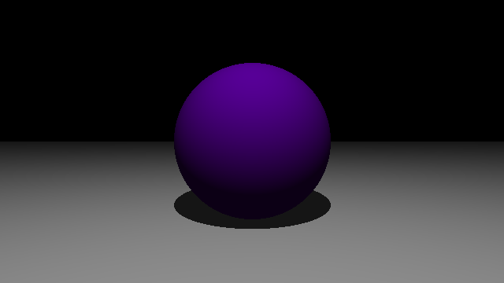

# Raytracing para todos

Bienvenido al tutorial Raytracing para todos. He hecho estas guías con el 
objetivo de que cualquiera que sepa Python y matemática vectorial simple 
pueda aprender algunos de los conceptos principales de Raytracing.

||
|Muestra de un render hecho en el tutorial|

También he decidido hacerlo en Español, ya que no he encontrado muchos 
tutoriales en esta lengua.

## Índice

Nota: los temas que no tienen link aún no están listos.

1. [Esfera simple](part-1)
2. [Plano infinito](part-2)
3. [Sombras](part-3)
4. Luces
5. Shaders
6. Texturas y materiales
7. Normal maps
8. Reflexión y refracción
9. Anti-aliasing
10. Animación
11. Depth of Field
12. Multi-Threading
13. PBR-BRDF-Multi Spectral
14. Mip-mapping
15. Backwards Raytracing (Caustics)

## Repositorio

El código fuente lo puedes encontrar en GitHub
[aquí](https://github.com/sombra-studio/raytracing-para-todos).

Para cada parte del tutorial puedes ir a la carpeta en el repositorio para ver los
archivos usados en esa parte. Asegúrate de instalar **numpy** y **pillow**.

Si quieres comentar algo, por favor hazlo directamente en el repositorio.

## Conocimientos previos

Se espera que para entender este tutorial sepas programar en Python e 
instalar paquetes usando pip. Tampoco voy a usar tiempo en explicar paquetes 
como Pillow o Numpy. Además se espera que tengas conocimientos de 
matemáticas de vectores, nada demasiado difícil.

## ¿Por qué Python?

Según los datos más actuales el lenguaje más popular es Python. Pero debido a
lo lento que los programas en Python son, comparado con C++ por ejemplo, es 
muy difícil encontrar tutoriales de Raytracing en Python. Pero buenas noticias,
para aprender los conceptos principales, no necesitas programas que sean 
mega veloces. Además desarrollar en Python es mucho más rápido, porque no 
requiere compilar, es un lenguaje muy simple y no tan verboso, no tienes que 
lidear con punteros ni complejas referencias o dependencias que tengas que 
instalar. Puedes instalar paquetes usando pip fácilmente.

PD: Si ya no te puedes aguantar hasta la siguiente parte del tutorial, puedes
mirar mi repositorio [sombra](https://github.com/HenrYxZ/sombra) donde ya tengo
un Raytracer en Python (que tiene algunos errores).

## Referencias

Si quieres profundizar más, aquí te dejo algunas fuentes que podrían ayudarte a
aprender más de Gráficas por Computador. Lamentablemente, son todas en inglés 
😕.

### Raytracing
- Raytracing Essentials por Nvidia
[YouTube](https://www.youtube.com/watch?v=gBPNO6ruevk&list=PL5B692fm6--sgm8Uiava0IIvUojjFOCSR)
- Intro to Raytracing por Rajesh Sharma (SIGGRAPH)
[YouTube](https://www.youtube.com/watch?v=3xMeKal2-Ws)
- Ray Tracing in One Weekend por Peter Shirley
[link](https://raytracing.github.io/books/RayTracingInOneWeekend.html)
- The Ray Tracer Challenge por Jamis Buck
[link](http://raytracerchallenge.com/)
- Physically Based Rendering por Matt Phar, Wenzel Jakob y Greg Humphreys
[link](https://www.pbrt.org/)
- Curso de Rendering por Ravi Ramamoorthi
[link](https://cseweb.ucsd.edu//~viscomp/classes/cse168/sp21/schedule.html)
- Curso de Rendering por TU Wien
[link](https://www.youtube.com/channel/UCS9CFdjdEcq_NhaSFb_P-yA)

### Gráficas en general
- Real-Time Rendering por Tomas Akenine-Möller, Eric Haines y Naty Hoffman
- Canal de Sebastian Lague
[YouTube](https://www.youtube.com/c/SebastianLague)
- Curso de Interactive Graphics por Cem Yuskel en la Universidad de Utah
[YouTube](https://www.youtube.com/watch?v=UVCuWQV_-Es&list=PLplnkTzzqsZS3R5DjmCQsqupu43oS9CFN)
- Tutorial de Shader Graph Basics por Ben Cloward
[YouTube](https://www.youtube.com/watch?v=OX_6_bKpP9g&list=PL78XDi0TS4lEBWa2Hpzg2SRC5njCcKydl)
- Curso de Animation & CGI Motion por Eitan Grinspun en la Universidad de 
  Columbia 
[link](https://www.edx.org/course/animation-and-cgi-motion-2)
- Cursos de Pixar en Khan Academy
[link](https://www.khanacademy.org/computing/pixar)
- Curso Interactive 3D Graphics por Autodesk en Udacity
[link](https://www.udacity.com/course/cs291)
- Curso GPU Programming for Video Games por Georgia Tech
[link](https://www.youtube.com/playlist?list=PLOunECWxELQQwayE8e3WjKPJsTGKknJ8w)