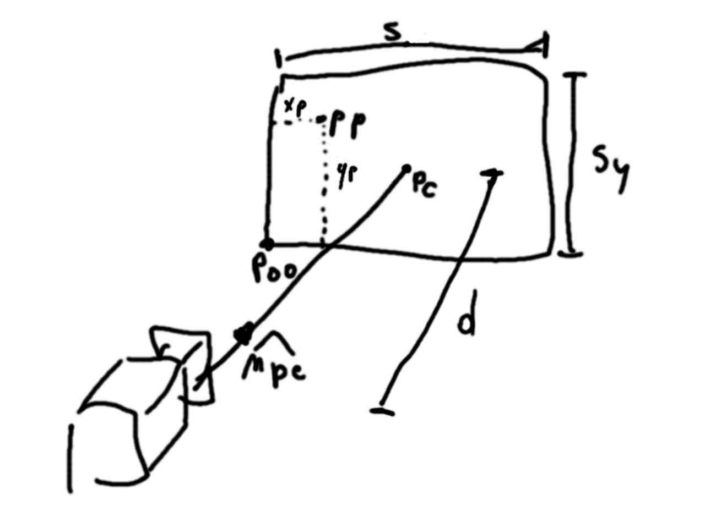
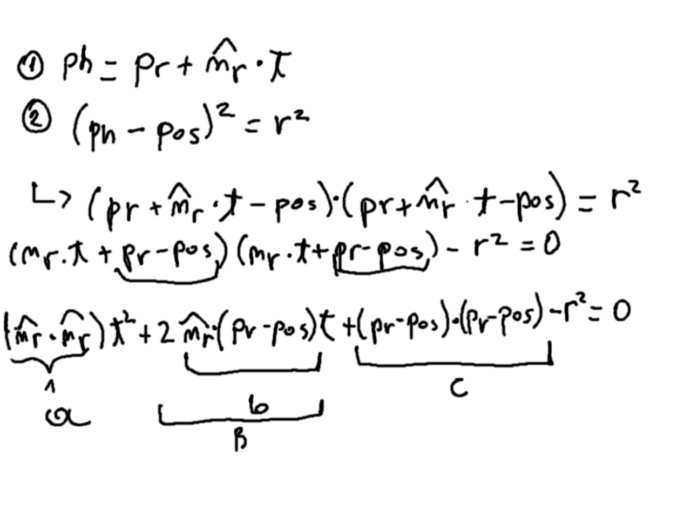
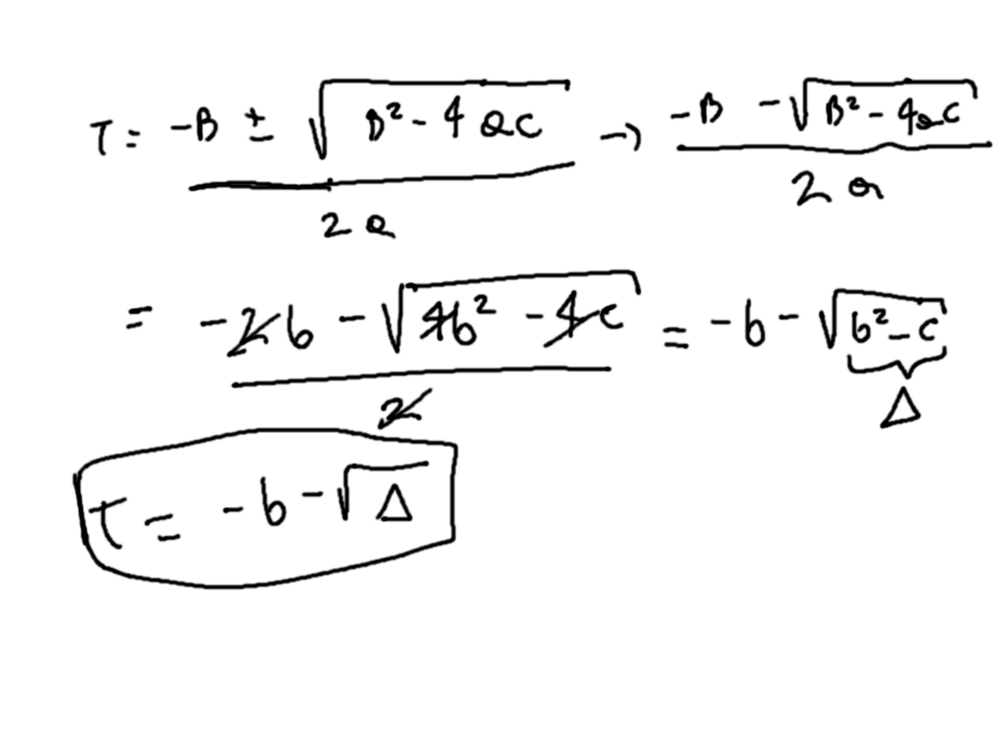
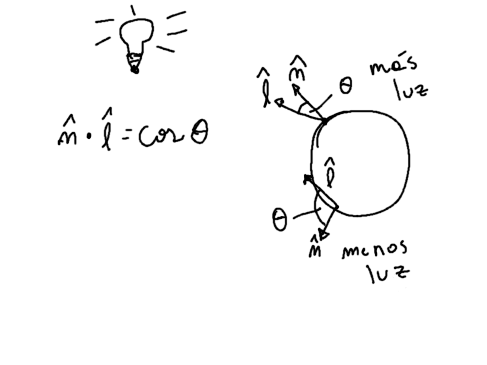

[volver](..)

# Parte 1

El objetivo de esta parte es poder generar nuestra primera imagen que será una
esfera de color morado con fondo negro.

Para hacer esto vamos a ver las siguientes cosas:

1. Cámara
2. Ventana de vista
3. Proyección
4. Pantalla
5. Raycasting
6. Intersección con esfera
7. Iluminación

Para poder crear imágenes lo que hacemos es simular la realidad. Así que vamos a
necesitar algo que simule el funcionamiento de una cámara. Algunos de los datos
importantes de una cámara en particular son su posición en el espacio y su 
orientación. La posición es un punto en espacio tridimensional, y para la
orientación generamos tres vectores unitarios y perpendiculares entre sí
(**n0**, **n1** y **n2**) que definen un espacio de coordenadas donde el lente
de la cámara es el origen.


```python
import numpy as np
import utils


class Camera:
    def __init__(self, pos, v_up, v_view):
        self.position = pos
        self.n0 = utils.normalize(np.cross(v_view, v_up))
        self.n1 = utils.normalize(np.cross(self.n0, v_view))
        self.n2 = utils.normalize(np.cross(self.n1, self.n0))
```

Luego podemos pensar en que todo lo que veremos en la pantalla al ver una
imagen representa una ventana (un plano) en el mundo que estamos simulando. 
Suponemos que esta ventana está siempre al frente de nuestra cámara a una
cierta distancia **d** y que tiene un ancho de **sx** y alto de **sy**. Luego
podemos definir **pc** que es el punto justo al centro de la ventana y **p00** 
que es el punto en la esquina inferior izquierda. Estos nos serviran 
posteriormente.



```python
import numpy as np
import utils


class Camera:
    def __init__(self, pos, v_up, v_view, d, sx, sy):
        self.position = pos
        self.n0 = utils.normalize(np.cross(v_view, v_up))
        self.n1 = utils.normalize(np.cross(self.n0, v_view))
        self.n2 = utils.normalize(np.cross(self.n1, self.n0))
        pc = self.position + d * self.n2
        self.p00 = pc - (sx / 2) * self.n0 - (sy / 2) * self.n1
        self.d = d
        self.sx = sx
        self.sy = sy
```

Ahora el algoritmo de Raycasting usado en Raytracing consiste en disparar rayos
desde el lente de nuestra cámara a, por lo menos, cada pixel que compone nuestra
pantalla. La pantalla y la ventana, son dos cosas distintas. Nuestra ventana 
tiene dimensiones y posición dentro de nuestro mundo simulado, pero la pantalla
es el espacio 2D donde vemos las imágenes que renderizamos. Entonces nuestra 
pantalla tiene cierta cantidad de pixeles en dirección horizontal y vertical.

Luego el código para generar una imagen es de la siguiente forma:

```python
RGB_CHANNELS = 3


def render(scene, camera, height, width):
    output = np.zeros([height, width, RGB_CHANNELS], dtype=np.uint8)
    for j in range(height):
        for i in range(width):
            """
            - crear rayo entre lente y punto (i,j) en la ventana
            - obtener el primer punto en que el rayo intersecta con un objeto
            - obtener color para ese punto pp y asignarlo al pixel
            """
```

Así que vamos recorriendo la pantalla pixel por pixel, generando rayos... ¿Pero
cómo generamos los rayos? Lo que cada rayo necesita es un punto de partida y un
vector de dirección. El punto de partida podría ser el lente de la cámara o el
punto donde el rayo intersecta la ventana, llamaremos a este punto **pp**. Luego
el vector director **npe** es un vector unitario en la dirección en que va el 
rayo. Con esta información podemos generar nuestro rayo.

Ahora bien, para calcular **pp** lo que hacemos es mapear cada pixel de la 
pantalla a un punto en la ventana que estará definido en el mundo. Para eso 
calcularemos **xp** e **yp** que seran las posiciones horizontal y vertical 
del punto en la ventana. Luego el punto **pp** se define como la suma entre 
el punto **p00**, **xp** projectado en el eje **n0** (de las coordenadas de 
cámara)
y **yp** projectado en el eje **n1**.

```python
RGB_CHANNELS = 3
MAX_COLOR = 255


def render(scene, camera, height, width):
    output = np.zeros([height, width, RGB_CHANNELS], dtype=np.uint8)
    for j in range(height):
        for i in range(width):
            xp = (i / width) * camera.sx
            # we use height - 1 as the first value for y, because images
            # start at the top pixel row
            yp = ((height - 1 - j) / height) * camera.sy
            pp = camera.p00 + xp * camera.n0 + yp * camera.n1
            npe = utils.normalize(pp - camera.position)
            ray = Ray(pp, npe)
            color = raytrace(ray, scene)
            output[j][i] = round(color * MAX_COLOR)
    return output
```

Faltaría definir la clase *Ray* y la función *raytrace*. Para la primera **pr**
será el punto donde el rayo inicia y **nr** el vector director.

```python
class Ray:
    def __init__(self, pr, nr):
        self.pr = pr
        self.nr = nr

    def intersect_sphere(self, sphere):
        # obtener el punto en que intersecta a la esfera o -1 si no lo hace
        pass
```

También vamos a definir la clase esfera. Que tendrá una posición, un radio y 
un color simple.

```python
class Sphere:
    def __init__(self, pos, radius, color):
        self.position = pos
        self.radius = radius
        self.color = color
```

Ahora para intersectar esta esfera con un rayo vamos a hacer lo siguiente. 
Supongamos que existe un punto **ph** que es la primera intersección del 
rayo con la esfera (nota que podrían haber dos). Entonces ese punto, 
pertence tanto al rayo como a la esfera, y satisface las ecuaciones 
implícitas de ambas:






Finalmente nuestro código para intersectar queda así (el triángulo es 
*discriminante*):

```python
class Ray:
    def __init__(self, pr, nr):
        self.pr = pr
        self.nr = nr

    def intersect_sphere(self, sphere):
        pc = sphere.position
        diff = self.pr - pc
        b = np.dot(self.nr, diff)
        c = np.dot(diff, diff) - sphere.radius ** 2
        discriminant = b ** 2 - c
        if b > 0 or discriminant < 0:
            return -1
        t = -1 * b - np.sqrt(discriminant)
        ph = self.pr + t * self.nr
        return ph
```

También nos queda nuestra función de raytrace que se preocupa de simular la
iluminación. Ésta recibe un rayo y una esfera y se preocupa de devolver el
color que se asignará si el rayo intersecta la esfera.

```python
RGB_CHANNELS = 3


def raytrace(ray, sphere):
    ph = ray.intersect_sphere(sphere)
    if ph:
        return sphere.color
    else:
        return np.zeros(RGB_CHANNELS)
```

Ahora si usamos esto, nuestro programa nos devolverá un círculo con color 
completamente igual, para que se vea 3D es necesario simular mejor la 
iluminación. Así que vamos a simular una luz que está en el mundo en una 
posición específica.

```python
class PointLight:
    def __init__(self, pos):
        self.position = pos
```

Para calcular color lo que hacemos en el punto **ph** es generar un 
vector unitario en dirección a la luz. Si la normal de la superficie en el 
punto apunta cerca de la luz quiere decir que la recibe más directamente, 
por ende estará mejor iluminada y reflejará más el color del objeto. Por el 
contrario si la normal apunta hacia otro lado quiere decir que le llega 
menos o no le llega luz. Esto lo podemos ver con el producto punto o coseno 
entre el vector que apunta a la luz y la normal (ojo, ambos unitarios). 
Llamaremos **l** al vector que apunta a la luz, y agregaremos una función en 
la clase esfera que nos entregue la normal para un punto en la esfera.



```python
class Sphere:
    def __init__(self, pos, radius, color):
        self.position = pos
        self.radius = radius
        self.color = color
    
    def normal_at(self, p):
        n = (p - self.position) / self.radius
        return n
```

```python
RGB_CHANNELS = 3


def raytrace(ray, sphere, light):
    ph = ray.intersect_sphere(sphere)
    if ph:
        n = sphere.normal_at(ph)
        l = utils.normalize(light.position - ph)
        diffuse_coef = np.dot(n, l)
        t = max(0, diffuse_coef)
        color = t * sphere.color
        return color
    else:
        return np.zeros(RGB_CHANNELS)
```

Y también tendremos que cambiar nuestro llamado a raytrace que hacemos desde 
render, ya que por ahora no vamos a definir una clase escena (lo haremos 
después).

```python
RGB_CHANNELS = 3
MAX_COLOR = 255


def render(sphere, light, camera, height, width):
    output = np.zeros([height, width, RGB_CHANNELS], dtype=np.uint8)
    for j in range(height):
        for i in range(width):
            xp = (i / width) * camera.sx
            # we use height - 1 as the first value for y, because images
            # start at the top pixel row
            yp = ((height - 1 - j) / height) * camera.sy
            pp = camera.p00 + xp * camera.n0 + yp * camera.n1
            npe = utils.normalize(pp - camera.position)
            ray = Ray(pp, npe)
            color = raytrace(ray, sphere, light)
            output[j][i] = round(color * MAX_COLOR)
    return output
```

Voilà! Tenemos todo lo necesario para generar nuestra primera imagen. 
Nuestro programa principal lucirá así:

```python
from PIL import Image
import numpy as np
# local modules
from camera import Camera
from light import PointLight
from render import render
from sphere import Sphere

OUTPUT_FILENAME = "img.png"
MAX_COLOR_VALUE = 255


def main():
    # Create sphere
    sphere_pos = np.array([0, 0, 1.5])
    sphere_rad = 0.4
    color_purple = np.array([75 / MAX_COLOR_VALUE, 0, 130 / MAX_COLOR_VALUE])
    sphere = Sphere(sphere_pos, sphere_rad, color_purple)
    # Create light
    light_pos = np.array([0, 1.5, 0])
    light = PointLight(light_pos)
    # Create camera
    camera_pos = np.array([0, 0, 0])
    v_up = np.array([0, 1, 0])
    v_view = np.array([0, 0, 1])
    d = 0.035
    width_ratio = 16
    height_ratio = 9
    aspect_ratio = width_ratio / height_ratio
    sy = d
    sx = sy * aspect_ratio
    camera = Camera(camera_pos, v_up, v_view, d, sx, sy)
    pixel_scale = 20
    width = width_ratio * pixel_scale
    height = height_ratio * pixel_scale
    img_arr = render(sphere, light, camera, height, width)
    img = Image.fromarray(img_arr)
    img.save(OUTPUT_FILENAME)
    print(f"Image saved in {OUTPUT_FILENAME}")


if __name__ == '__main__':
    main()
```

Lo que produce una imagen final como esta 🙂:


[volver](..)
