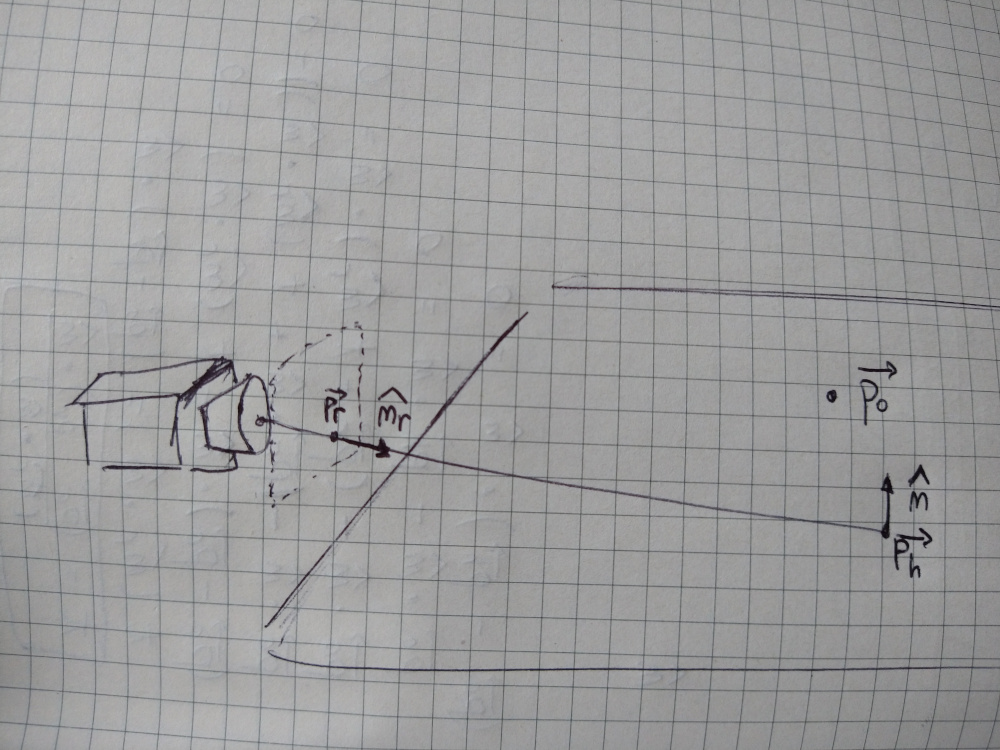
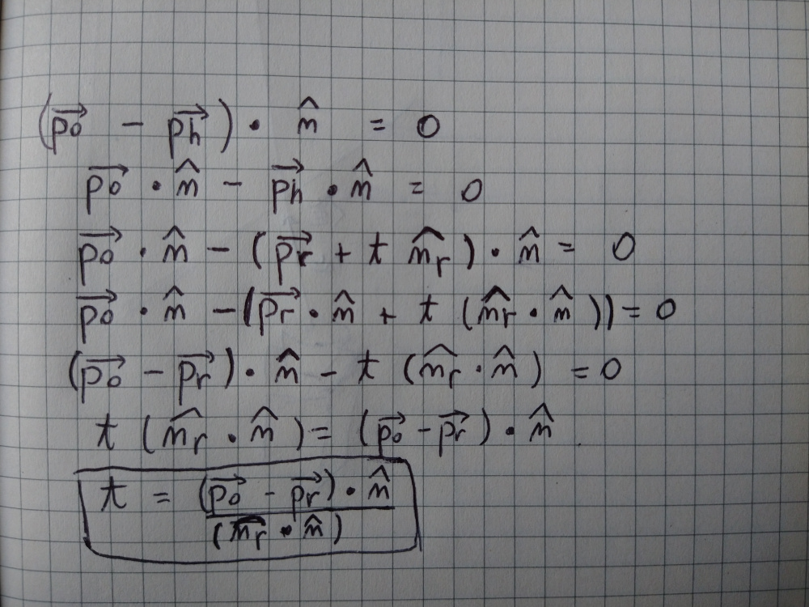

[volver](..)

# Parte 2

Ahora veremos cómo podemos integrar planos en nuestro sistema. Para definir 
un plano en 3D necesitamos un punto que pertenezca al plano **p0** y la 
normal al plano **n**. Para mantener las cosas simples vamos a usar planos 
infinitos. Para saber si un punto **p** pertenece al plano infinito se tiene 
que cumplir que:

`np.dot(p - p0, n) == 0`

Es decir, el segmento entre el punto **p** y **p0** es perpendicular a la 
normal del plano.



Luego para obtener intersección entre un rayo y un plano, podemos suponer 
que existe una intersección y escribir la ecuación que cumpliría el punto de 
intersección **ph**. Además, recuerda que todo punto **p** en el rayo cumple 
con `p = pr + t * nr` con `t > 0`.



De este modo tenemos:

1. Si se cumple `np.dot(nr, n) == 0` significa que la normal del plano 
   es perpendicular al director del rayo, lo que significaría que nuestro 
   rayo es paralelo al plano. Por lo tanto, o no lo intersecta, o lo 
   intersecta siempre si se superponen.
2. Si `t < 0` para `t = np.dot(p0 - pr, n) / np.dot(nr, n)`, quiere decir 
   que la intersección se encuentra por detrás del inicio de nuestro rayo 
   (**pr**) y por tal motivo no vemos ese punto desde la cámara.
3. Si `t > 0` entonces hemos encontrado la intersección.

Así nuestro código para intersectar un rayo queda así:

```python
def intersect_plane(self, plane):
    n_dot = np.dot(self.nr, plane.n)
    if n_dot == 0:
        return -1
    t = np.dot(plane.position - self.pr, plane.n) / n_dot
    if t > 0:
        return t
    return -1
```

También tendremos que crear nuevas clases *Scene* que tendra una colección 
de *SceneObject* que serán los objetos en nuestra escena (como esferas y 
planos). Y actualizar la función *render* para que en vez de tomar un solo
objeto, tome una escena entera para renderizarla, y la función *raytrace* 
también para que tome la escena entera y calcule el color para el punto de 
intersección más cercano. Nota que un rayo podría intersectar varios objetos 
de una escena pero solo el más cercano será el que veremos.

```python
class Scene:
    def __init__(self):
        self.objects = []


class SceneObject:
    def __init__(self, pos, color):
        self.position = pos
        self.color = color

    def normal_at(self, p):
        pass


class Plane(SceneObject):
    def __init__(self, pos, color, n):
        SceneObject.__init__(self, pos, color)
        self.n = n

    def normal_at(self, p):
        return self.n
```

```python
def raytrace(ray, scene, light):
    min_t = np.inf
    hit_obj = None
    for scene_object in scene.objects:
        t = ray.intersect(scene_object)
        if t > 0 and t < min_t:
            hit_obj = scene_object
            min_t = t
    if hit_obj is not None:
        ph = ray.at(min_t)
        n = hit_obj.normal_at(ph)
        l = utils.normalize(light.position - ph)
        diffuse_coef = np.dot(n, l)
        t = max(0, diffuse_coef)
        color = t * hit_obj.color
        return color
    else:
        return np.zeros(RGB_CHANNELS)
```

Nota que también hemos cambiado la forma en que devuelve valor la función 
*intersect*. Antes devolvía un punto, ahora para simplificar la comparación de 
qué está más cerca y qué está más lejos usamos **t**, que es el escalar que 
nos dice cuánto avanzamos en el rayo desde su punto de partida **pr**.

Finalmente nuestra función *main* queda así:

```python
def main():
    # Create sphere
    sphere_pos = np.array([0, 0, 1.5])
    sphere_rad = 0.4
    color_purple = np.array([75 / MAX_COLOR_VALUE, 0, 130 / MAX_COLOR_VALUE])
    sphere = Sphere(sphere_pos, color_purple, sphere_rad)
    # Create plane
    plane_pos = np.array([0, -0.4, 0])
    color_gray = np.array([
        130 / MAX_COLOR_VALUE, 130 / MAX_COLOR_VALUE, 130 / MAX_COLOR_VALUE
    ])
    plane_n = np.array([0, 1, 0])
    plane = Plane(plane_pos, color_gray, plane_n)
    # Create Scene
    scene = Scene()
    scene.objects = [sphere, plane]
    # Create light
    light_pos = np.array([0, 1.5, 0])
    light = PointLight(light_pos)
    # Create camera
    camera_pos = np.array([0, 0, 0])
    v_up = np.array([0, 1, 0])
    v_view = np.array([0, 0, 1])
    d = 0.035
    width_ratio = 16
    height_ratio = 9
    aspect_ratio = width_ratio / height_ratio
    sy = d
    sx = sy * aspect_ratio
    camera = Camera(camera_pos, v_up, v_view, d, sx, sy)
    pixel_scale = 40
    width = width_ratio * pixel_scale
    height = height_ratio * pixel_scale
    img_arr = render(scene, light, camera, height, width)
    img = Image.fromarray(img_arr)
    img.save(OUTPUT_FILENAME)
    print(f"Image saved in {OUTPUT_FILENAME}")
```

Lo que produce la siguiente imagen:


## Progreso

Ahora que nuestro raytracer se demora un poco más, ya que hace muchos 
cálculos para las intersecciones, será mejor mostrar el progreso de nuestro 
programa para que podamos estimar cuánto falta para que termine de renderear.
Para eso usamos la librería *progress*. Puedes encontrarla
[aqui](https://github.com/verigak/progress).

En nuestro módulo render agregamos un Bar y luego nos queda así:

```python
import numpy as np
from progress.bar import Bar

# local modules
from ray import Ray
from raytrace import raytrace
import utils

MAX_COLOR = 255
RENDERING_MSG = "Rendering"
RGB_CHANNELS = 3


def render(scene, light, camera, height, width):
    output = np.zeros([height, width, RGB_CHANNELS], dtype=np.uint8)
    total_count = height * width
    bar = Bar(
        RENDERING_MSG,
        max=total_count,
        suffix='%(percent)d%% [%(elapsed_td)s / %(eta_td)s]',
        check_tty=False
    )
    for j in range(height):
        for i in range(width):
            xp = (i / width) * camera.sx
            # we use height - 1 as the first value for y, because images
            # start at the top pixel row
            yp = ((height - 1 - j) / height) * camera.sy
            pp = camera.p00 + xp * camera.n0 + yp * camera.n1
            npe = utils.normalize(pp - camera.position)
            ray = Ray(pp, npe)
            color = raytrace(ray, scene, light)
            output[j][i] = np.round(color * MAX_COLOR)
            bar.next()
    bar.finish()
    return output

```

Con esto nuestro programa imprimirá en consola el progreso que lleva y también
quedará cuánto demoró.

Eso es todo para esta parte del tutorial 😁, estén atentos a las próximas partes
porque aun queda mucho por aprender!

[volver](..)
