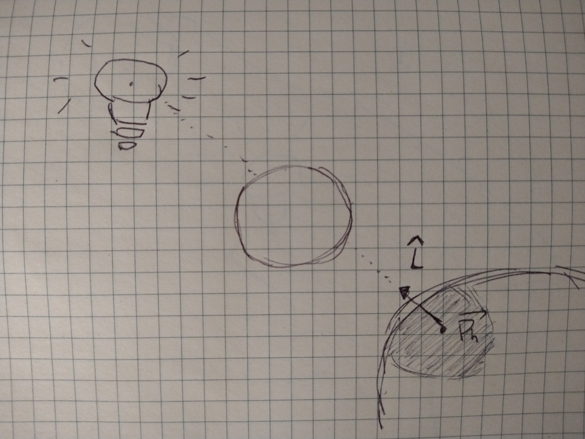
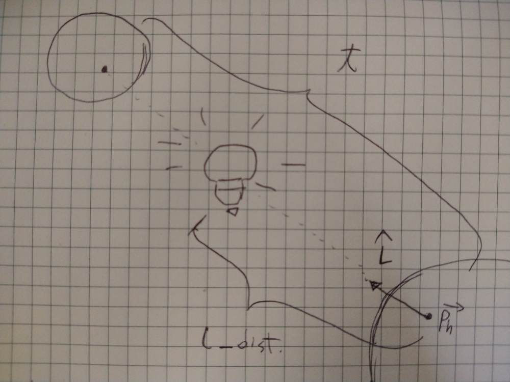
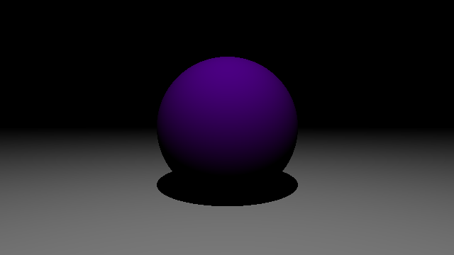

[volver](..)

# Parte 3

Ahora veremos cómo crear sombras. Para esto hay que seguir el mismo sistema 
anterior en que disparamos rayos desde la cámara, obtenemos la primera 
intersección con un objeto y calculamos el color para ese punto, el que 
luego será asignado al pixel correspondiente. Lo normal es que cuando hay 
una sombra uno ve una pequeña parte del color de la superficie y otra buena 
parte de oscuridad. La oscuridad se debe a la ausencia de luz, y esta se 
produce cuando hay un objeto tapando el camino entre la superficie y la 
fuente de luz. La siguiente imagen puede ayudar a ilustrar este concepto:



Lo que debemos hacer entonces para saber si existe un objeto ocluyendo la 
superficie, es:

1. Disparar un rayo desde el punto de intersección en la superficie, en 
   dirección a la fuente de luz
2. Para el resto de los objetos, verificar si este nuevo rayo los intersecta.
3. Si la intersección ocurre en el segmento entre el punto de la superficie 
   y la fuente de luz, entonces el punto tiene sombra. De lo contrario, el 
   objeto no está ocluyendo la luz.

Como generamos un nuevo rayo por punto de intersección, el programa se hará 
más lento ya que computamos el doble, además también hay que iterar con el 
resto de objetos para encontrar intersección (el cual generará sombra).



Este es el código que necesitarías cambiar en la función *raytrace*:

```python
import numpy as np
import utils


# Local imports
from ray import Ray

COLOR_CHANNELS = 3
SHADOW_COLOR = np.zeros(COLOR_CHANNELS)


def get_min_intersection(ray, objects):
    min_t = np.inf
    hit_obj = None
    # Get first hit with an object by checking intersection with all objects
    for scene_object in objects:
        t = ray.intersect(scene_object)
        if 0 < t < min_t:
            hit_obj = scene_object
            min_t = t
    return min_t, hit_obj


def calculate_occlusion(ray, obj, light, objects):
    light_distance = light.get_distance(ray.pr)
    for other_obj in objects:
        if other_obj == obj:
            continue
        shadow_t = ray.intersect(other_obj)
        if 0 < shadow_t <= light_distance:
            return True
    return False


def raytrace(ray, scene, light):
    min_t, hit_obj = get_min_intersection(ray, scene.objects)
    if hit_obj is not None:
        ph = ray.at(min_t)
        n = hit_obj.normal_at(ph)
        l = utils.normalize(light.position - ph)
        diffuse_coef = np.dot(n, l)
        diffuse_coef = np.clip(diffuse_coef, 0, 1)
        shadow_ray = Ray(ph, l)
        occlusion = calculate_occlusion(
            shadow_ray, hit_obj, light, scene.objects
        )
        color = diffuse_coef * hit_obj.color if not occlusion else SHADOW_COLOR
        return color
    else:
        return np.zeros(COLOR_CHANNELS)
```

Además para poder calcular distancia en la clase Light, modifica el archivo 
*light.py*:

```python
import utils


class PointLight:
    def __init__(self, pos):
        self.position = pos

    def get_distance(self, p):
        distance = utils.distance(self.position, p)
        return distance
```

Y en *utils.py* agrega:

```python
def distance(p1, p2):
    dist = np.linalg.norm(p1 - p2)
    return dist
```

Al correr esto obtendras esta imagen:



La imagen se acerca algo más a la realidad pero de algún modo la sombra no 
se ve realista. Esto es porque es completamente negra, lo que genera un 
contraste demasiado fuerte. En la realidad, parte de la luz rebota en las 
superficies generando iluminación indirecta. Hasta ahora nosotros solo hemos 
tomado en cuenta la iluminación proveniente directamente de la fuente de luz.
Un hack muy simple que se usa normalmente en Gráficas por Computador para 
simular la luz indirecta puede ser añadir una componente de luz ambiente. 
Añadamos esto en nuestra función *raytrace*:

```python
# At the beginning define ambient light
AMBIENT_LIGHT = np.ones(COLOR_CHANNELS) * 0.12

# ...
# In the raytrace function
shadow_ray = Ray(ph, l)
occlusion = calculate_occlusion(
   shadow_ray, hit_obj, light, scene.objects
)
if not occlusion:
   diffuse_color = diffuse_coef * hit_obj.color
else:
   diffuse_color = SHADOW_COLOR
ambient_color = AMBIENT_LIGHT * hit_obj.color
color =  np.clip(diffuse_color + ambient_color, 0, 1)
```

Y finalmente tendrás una imagen así ✨:


[volver](..)
